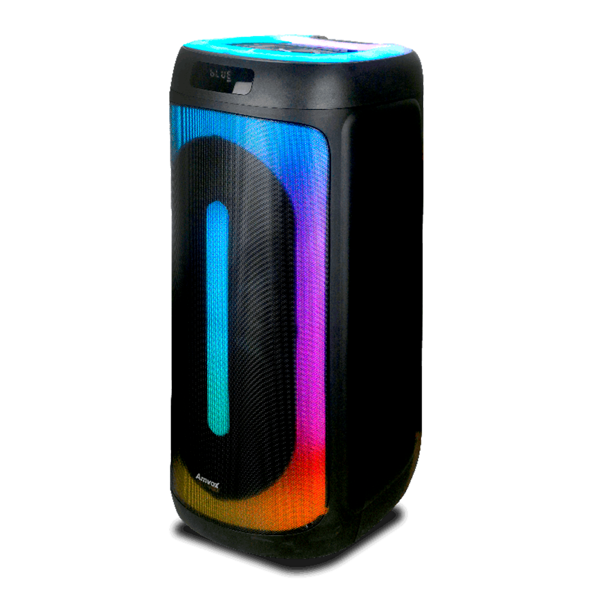

# Impacto Eventos - Landing Page

Este é o repositório da landing page para a **Impacto Eventos**, uma empresa especializada em transformar momentos em experiências inesquecíveis. O site foi projetado para ser moderno, atraente e informativo, apresentando os serviços, portfólio e informações de contato da empresa.

## 📸 Visualização



*Uma prévia de como o site se parece. Recomenda-se substituir por uma captura de tela completa da página inicial.*

## ✨ Features

- **Design Moderno e Responsivo**: Totalmente adaptável para desktops, tablets e celulares.
- **Tema Escuro (Dark Mode)**: Interface elegante que destaca as imagens e o conteúdo.
- **Animações Dinâmicas**: Efeitos de scroll com a biblioteca `AOS` (Animate On Scroll) para uma experiência de usuário mais fluida.
- **Cabeçalho Interativo**: Efeito de partículas com `Particles.js` e título com efeito de digitação usando `Typed.js`.
- **Seções Completas**:
  - **Serviços**: Detalhes sobre sonorização, iluminação, efeitos especiais e mais.
  - **Tipos de Eventos**: Foco em aniversários, casamentos, eventos sociais e corporativos.
  - **Galeria**: Portfólio visual com um grid de imagens moderno.
  - **Depoimentos**: Prova social com feedback de clientes.
  - **Sobre Nós**: A história e a missão da empresa.
  - **Contato**: Formulário de contato e informações diretas como telefone e WhatsApp.

## 🛠️ Tecnologias Utilizadas

- **HTML5**: Estrutura semântica do site.
- **Tailwind CSS**: Framework CSS para estilização rápida e responsiva.
- **JavaScript (ES6+)**: Interatividade e manipulação do DOM.
- **Bibliotecas JavaScript**:
  - [AOS (Animate On Scroll)](https://michalsnik.github.io/aos/): Para animações ao rolar a página.
  - [Particles.js](https://vincentgarreau.com/particles.js/): Para o efeito de partículas no background.
  - [Typed.js](https://github.com/mattboldt/typed.js): Para o efeito de digitação no título.
- **Font Awesome**: Ícones utilizados em todo o site.

## 🚀 Como Executar

Este é um projeto de site estático. Nenhuma instalação de dependência é necessária.

1. **Clone o repositório:**
   ```bash
   git clone https://github.com/seu-usuario/impacto-eventos.git
   ```
2. **Navegue até o diretório do projeto:**
   ```bash
   cd impacto-eventos
   ```
3. **Abra o arquivo `index.html` no seu navegador de preferência.**

E pronto! O site estará rodando localmente.

## 📂 Estrutura de Arquivos

```
/
├── index.html      # Arquivo principal da página
├── images/         # Pasta com todas as imagens do projeto
└── README.md       # Este arquivo
```

## 🤝 Contribuições

Contribuições são bem-vindas! Se você tiver alguma ideia para melhorar o projeto, sinta-se à vontade para abrir uma *issue* ou enviar um *pull request*.
